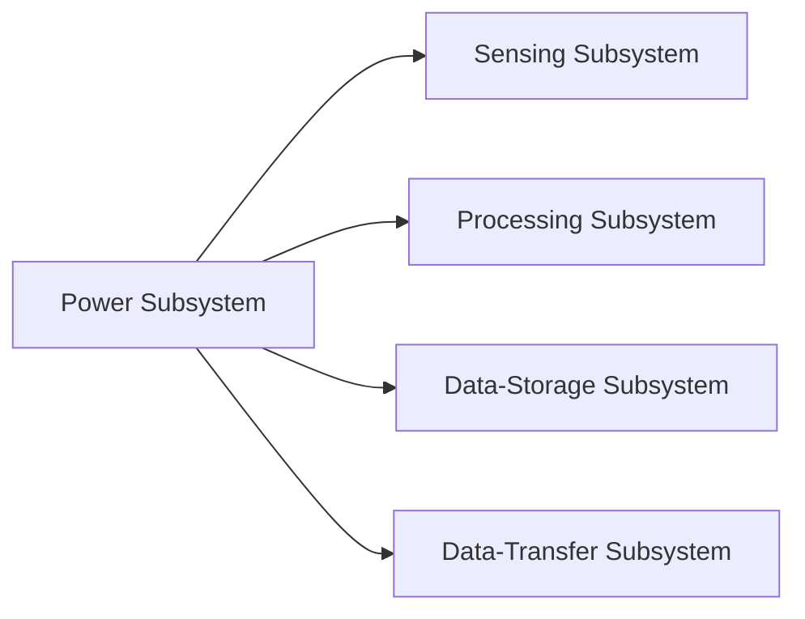
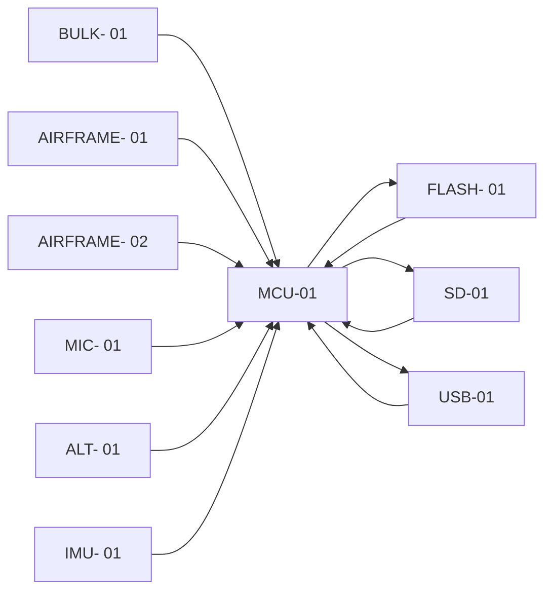
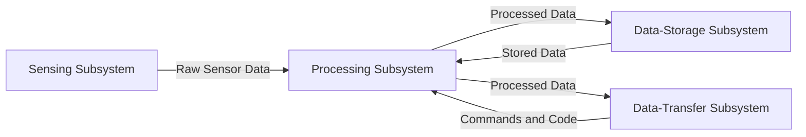

# High-Level System Architecture

**Architecture Status:** Preliminary  

## 1. Purpose of This Document

This document provides a high-level system architecture for the ISAQ project. It describes the major system components, their interactions, and the preliminary data and power distribution concepts.

This architecture is considered **preliminary** and subject to change until frozen in a later design review.

## 2. System Overview
The Instrumentation System is composed of multiple subsystems that together support sensing, data processing, power management and data transfer.
At a high level, the System consists of the next subsystems:
- Processing Subsystem
- Data-Storage Subsystem
- Power Subsystem
- Data-Transfer Subsystem
- Sensing Subsystem

## 3. Power Distribution Block Diagram

## 4. Subsystem Description

### 4.1 Power Subsystem
The Power Subsystem is responsible for the generation, storage, conditioning, and distribution of electrical power to all subsystems within the Instrumentation
System.
The Power Subsystem performs the following high-level functions:
- Electrical power input
- Power conditioning and voltage regulation
- Distribution of regulated power to all subsystems
- Protection against electrical faults
### 4.2 Sensing Subsystem
The Sensing Subsystem is responsible for acquiring physical measurements required by the mission and converting them into digital data for processing.
The Sensing Subsystem performs the following high-level functions:
- Measurement of physical parameters
- Conversion of physical signals into digital data
- Transmission of raw sensor data to the Processing Subsystem
The sensing subsystem will have the next sensors:

| Sensor ID | Description | Location | Quantity |
|---------|-------------|----------------|------------|
|BULK- 01| Sensor located in the bulkhead for measuring its deformation in different points | Bulkhead | 3 |
|AIRFRAME- 01| Sensor located in the airframe of the vehicle for measuring its deformation on different axes | Fuselage | 4 |
|AIRFRAME- 02| Sensor located in the airframe of the vehicle for measuring its loads on different axes | Fuselage | 4 |
|TEMP- 01| Sensor located in the avionics bay for measuring the temperature of the onboard cameras and computers | Avionics Bay | 4 |
|MIC- 01| Sensor located in the avionics bay for recording the sounds inside the vehicle | Avionics Bay | 1 |
|ALT- 01| Sensor for measuring the ambient pressure and altitude | Avionics Bay | 1 |
|IMU- 01| Gyroscope, Accelerometer and Magnetometer for measuring vehicle's attitude, acceleration and velocity | Avionics Bay | 1 |
### 4.3 Processing Subsystem
The Processing Subsystem is the central control and data-handling element of the Instrumentation System. It coordinates system operations, processes data acquired
from the Sensing Subsystem, and manages data exchange with the Data-Storage and Data-Transfer subsystems.
The Processing Subsystem performs the following high-level functions:
- Control and reading of the Sensing Subsystem
- Management of data storage and retrieval operations
- Data pass to the Data-Transfer Subsystem
- Execution of control logic
The Processing Subsystem will be described in the Architecture with the next components:

| Sensor ID | Description |
|---------|-------------|
|MCU- 01| Main processor for the Instrumentation System |
### 4.4 Data Storage Subsystem
The Data-Storage Subsystem provides non-volatile storage capabilities for data generated and processed within the Instrumentation System.
The Data-Storage Subsystem performs the following high-level functions:
- Storage of processed and/or raw sensor data
- Temporary buffering of data prior to external transmission
- Retrieval of stored data under control of the Processing Subsystem
The Data Storage Subsystem will be described in the Architecture with the next components:

| Sensor ID | Description |
|---------|-------------|
|FLASH- 01| non-volatile memory for storing data during flight |
|SD-01| Memory for storing data after landing |
### 4.5 Data Transfer Subsystem
The Data-Transfer Subsystem manages the exchange of data between the Instrumentation System and external systems, also is the subsystem in charge of programming the Processing Subsystem.
The Data-Transfer Subsystem performs the following high-level functions:
- Transfer of flight data to a computer.
- Reception of external data, commands or code for the processing subsystem.
The Data Transfer Subsystem will be described in the Architecture with the next components:

| Sensor ID | Description |
|---------|-------------|
|USB- 01| USB for data tranfer |

## 5. Architecture Block Diagram

## 6. Data Block Diagram

