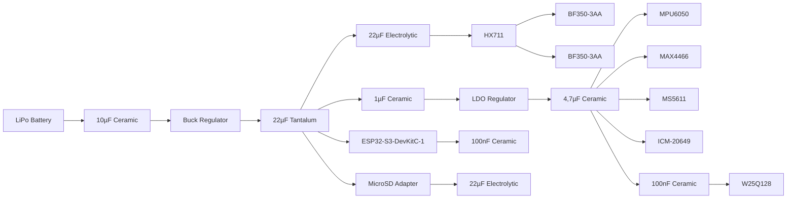

# Final Power Architecture and Budget

## 1. Purpose of this Document
This document defines the final power architecture for the TBD project. The information focuses on voltage stability and noise immunity to ensure the integrity of the data obtained.

## 2. Final Power Budget

| Sensor ID | Component | Supply Voltage (VDD)| Rated Current Consumption | Possible Current Spikes | Quantity |
| :---: | :---: | :---: | :---: | :---: | :---: |
| MCU-01 | ESP32-S3-DevKitC-1 | 5V | 500mA | 340mA | 1 |
| BULK-01 | BF350-3AA | 5V | 14,2mA | - | 6 |
| AIRFRAME-01 | BF350-3AA | 5V | 14,2mA | - | 8 |
| BULK-01/AIRFRAME-01 ADC | HX711 | 5V | 1,4mA | - | 7 |
| AIRFRAME-02 | MPU6050 | 3,3V | 3,9mA | - | 2 |
| TEMP-01 | ADT7410 | 3,3V | 0,21mA | - | 4 |
| MIC-01 | MAX4466 | 3,3V | 0,06mA | - | 1 |
| ALT-01 | MS5611 | 3,3V | 0,0125mA | - | 1 |
| IMU-01 | ICM-20649 | 3,3V | 3,21mA | - | 1 |
| FLASH-01 | W25Q128 | 3,3V | 25mA | 25mA | 1 |
| SD-01 | MicroSD Adapter | 5V | 80mA | 200 mA | 1 |
|  | | **Total** | 632,5925mA | 565mA |

- **Total:** Rated Current Consumption

$$
TotalCurrentConsumption ≈ 632,6mA
$$

## 3. Battery Final Selection
### Primary Considerations
- **Capacity (mAh)**

$$
FinalCapacity = I_T (mA) \cdot \ T (Hours)
$$

$$
FinalCapacity = 632,6mA \cdot \ 4h
$$

$$
FinalCapacity = 2530,4mAh
$$

- **Voltage (V)**

    Voltage not too high but sufficient to facilitate regulation at 5V and 3.3V, preventing heat spikes.

### Final Battery Selection 

| **Configuration** | **Voltage** | **Final Capacity** | **Notes**|
| :---: | :---: | :---: | :---: |
| 2S lithium-ion Battery | 7,4V | 3000mA | Capacity based on a minimum autonomy of 4 hours. Reference 18650, packaged in a cylindrical metallic casing |

## 4. Final Power Topology

### Waterfall Bus Architecture

| **Stage** | **Function** | **Bus Components** |
| :---: | :---: | :---: |
| First Stage | 7,4V → 5V | ESP32-S3-DevKitC-1, MicroSD Adapter, HX711 → BF350-3AA |
| Second Stage | 5V → 3,3V | MPU6050, ADT7410, MAX4466, MS5611, ICM-20649, W25Q128 |

### Two-Stage Power Topology (Buck + LDO)
- The **first stage** implements a **buck regulator** to reduce the nominal **7.4V input to 5V** in a simple and efficient way. The ESP32, the microSD adapter module and the HX711 module will be connected to this bus.
- The **second stage** consists of creating a linear bus for the other components. An **LDO regulator** that reduces **5V to 3.3V** is chosen instead of connecting them all to the microcontroller's 3.3V pin because they exceed the thermal capacity of the integrated regulator and compromise the integrity of the analog signal.

| **Buck Regulator** | **LDO Regulator** |
| :---: | :---: |
| High Efficiency Conversion | Insulation and Cleanliness |

## 5. Final Regulator Shortlist
### BUCK Selection

|| **Regulator** | **Continuous Load Current** | **Efficiency** | **Switching Frequency**| **Final Score** |
| :---: | :---: | :---: | :---: | :---: | :---: |
| **%** | - | **20** | **30** | **50** | - |
|  | **MP1584** | **3A** | **92%** | **100kHz - 1.5MHz** | **779,4** |
|  | MP2307 | 3A | 96% | 340kHz | 199,4 |

Final BUCK Regulator: **MP1584**

### LDO Selection

|| **Regulator** | **Vin(max)** | **Vout(max)** | **Noise (µVrms)**| **PSRR (dB)** | **Final Score** |
| :---: | :---: | :---: | :---: | :---: | :---: | :---: |
| **%** | - | **15** | **20** | **30** | **35** | - |
| | TPS7A21 | 6V | 5,5V | 7,7 | 61 | 25,66 |
| | TPS7A20 | 6V | 5,5V | 7 | 60 | 25,1 |
| | **LP5907** | **5,5V** | **4,5V** | **6,5** | **60** | **24,675** |

Final LDO Regulator: **LP5907**

### REGULATOR LIST

| **Regulator Name** | **Category** | 
| :---: | :---: |
| MP1584 | BUCK | 
| LP5907 | LDO | 

## 6. Final Power Integrity
This section describes how noise will be cleaned up and the signal from the components will be improved.
- There are 4 critical points:
    - Buck and LDO regulators
    - ESP32
    - MicroSD
    - W25Q128 (Flash Module)

| **Component** | **Location** | **Capacitance Value** | **Voltage** | **Type**| **Quantity** | Notes |
| :---: | :---: | :---: | :---: | :---: | :---: | :---: |
| BUCK | Input (7,4V) | 10µF | 16V | X7R Ceramic | 1 | Supports LiPo's max 8.4V with a 50% margin |
| BUCK | Output (5V) | 22µF | 10V | Tantalum | 1 | Stabilizes the ESP32 rail. Tantalum is chosen because it does not vary with load |
| LDO | Input (5V) | 1µF | 10V | X7R Ceramic | 1 | Prevents noise from the Buck from causing the LP5907 to oscillate |
| LDO | Output (3,3V) | 4,7µF | 10V | X7R Ceramic | 1 | High-quality filtration for gauges |
| ESP32-S3 | ADC | 100nF | 10V | X7R Ceramic | 1 | Cleans thermal noise before analog conversion |
| Micro SD | VCC | 22µF | 10V | Electrolytic | 1 | High capacity to absorb potential SD current spikes |
| W25Q128 | VCC | 100nF | 10V | X7R Ceramic | 1 | Keeps the chip voltage stable and prevents noise from spreading to the sensors |
| HX711 | VCC | 22µF | 16V | Electrolytic | 7 | Isolates digital noise from gauges |

## 7. Final Power Tree

---
**Status:** Finished
